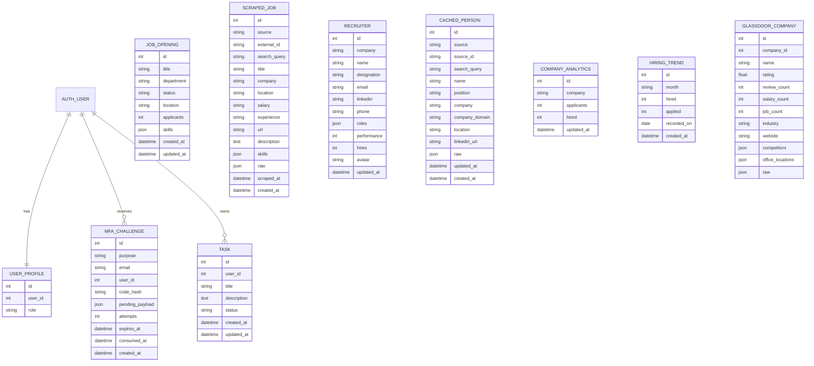

# HireAI Database Design

HireAI uses Django ORM models backed by SQLite for local development. The model layer is organized around authentication, job intelligence, recruiter/company intelligence, scraping cache records, and dashboard analytics.

## Entity Relationship Diagram

## Tables and Fields

### `auth_user`

Django's built-in user table stores account identity and authentication metadata.

| Field | Type | Description |
|---|---|---|
| `id` | integer | Primary key |
| `username` | string | Login identifier, usually email-like |
| `email` | string | User email address |
| `password` | string | Hashed password |
| `first_name`, `last_name` | string | Profile name fields |
| `is_staff`, `is_superuser`, `is_active` | boolean | Django access flags |
| `last_login`, `date_joined` | datetime | Account metadata |

### `authentication_userprofile`

Stores HireAI-specific role information.

| Field | Type | Description |
|---|---|---|
| `id` | integer | Primary key |
| `user_id` | foreign key | One-to-one link to `auth_user` |
| `role` | enum/string | `admin`, `recruiter`, or `analyst` |

### `authentication_mfachallenge`

Stores OTP challenges for registration, login, and password reset.

| Field | Type | Description |
|---|---|---|
| `purpose` | enum/string | `register`, `login`, or `password_reset` |
| `email` | email | Email that receives the OTP |
| `user_id` | foreign key/null | Linked user for login/reset challenges |
| `code_hash` | string | Hashed OTP, never plaintext |
| `pending_payload` | JSON | Registration payload held until OTP verification |
| `attempts` | integer | Failed/total verification attempt count |
| `expires_at` | datetime | OTP expiry time |
| `consumed_at` | datetime/null | Set after successful verification or invalidation |
| `created_at` | datetime | Challenge creation time |

### `tasks_task`

Generic user-owned task records.

| Field | Type | Description |
|---|---|---|
| `user_id` | foreign key | Owner |
| `title` | string | Task title |
| `description` | text | Optional task details |
| `status` | enum/string | `todo`, `in_progress`, or `completed` |
| `created_at`, `updated_at` | datetime | Audit timestamps |

### `tasks_jobopening`

Internal job openings displayed alongside scraped/platform listings.

| Field | Type | Description |
|---|---|---|
| `title` | string | Job title |
| `department` | string | Department or internal company grouping |
| `status` | enum/string | `Active`, `Draft`, or `Closed` |
| `location` | string | Role location |
| `applicants` | integer | Applicant count |
| `skills` | JSON array | Skills attached to the opening |
| `created_at`, `updated_at` | datetime | Audit timestamps |

### `tasks_scrapedjob`

Persisted dynamic/external job listings.

| Field | Type | Description |
|---|---|---|
| `source` | string | Source platform or data origin |
| `external_id` | string | Source-specific unique identifier |
| `search_query` | string | Search query that produced the row |
| `title`, `company`, `location` | string | Normalized listing metadata |
| `salary`, `experience` | string | Extracted listing attributes |
| `url` | URL | Source listing URL |
| `description` | text | Listing description |
| `skills` | JSON array | Parsed skill terms |
| `raw` | JSON | Full raw source payload |
| `scraped_at`, `created_at` | datetime | Collection timestamps |

Constraints and indexes:

- Unique constraint: `(source, external_id)`
- Index: `(search_query, source)`
- Default ordering: newest `scraped_at` first

### `tasks_recruiter`

Recruiter/contact intelligence shown in the recruiter panel.

| Field | Type | Description |
|---|---|---|
| `company` | string | Company connected to recruiter |
| `name` | string | Recruiter name |
| `designation` | string | Job title/designation |
| `email`, `linkedin`, `phone` | string | Contact channels |
| `roles` | JSON array | Role areas handled |
| `performance` | integer | Dashboard performance score |
| `hires` | integer | Hire count |
| `avatar` | URL | Optional profile image |
| `updated_at` | datetime | Last update time |

### `tasks_cachedperson`

Caches people-search results from CompanyEnrich or Apollo.

| Field | Type | Description |
|---|---|---|
| `source` | string | `companyenrich`, `apollo`, or other provider |
| `source_id` | string | Provider person ID |
| `search_query` | string | Normalized search query |
| `name`, `first_name`, `last_name` | string | Person identity fields |
| `position`, `seniority`, `department` | string | Professional metadata |
| `company`, `company_domain` | string | Current company metadata |
| `location` | string | Person location |
| `linkedin_url`, `image_url` | URL | Profile URLs |
| `raw` | JSON | Original provider payload |

Constraints and indexes:

- Unique constraint: `(source, source_id)`
- Index: `(search_query, source)`

### `tasks_companyanalytics`

Company-level applicant and hire metrics.

| Field | Type | Description |
|---|---|---|
| `company` | string | Unique company name |
| `applicants` | integer | Applicant count |
| `hired` | integer | Hired count |
| `updated_at` | datetime | Last update time |

### `tasks_hiringtrend`

Monthly hiring trend records used for charts and KPIs.

| Field | Type | Description |
|---|---|---|
| `month` | string | Display month label |
| `hired` | integer | Hired count |
| `applied` | integer | Application count |
| `recorded_on` | date | Date used for filtering |
| `created_at` | datetime | Row creation timestamp |

### `tasks_glassdoorcompany`

Company profile and employer-intelligence data.

| Field | Type | Description |
|---|---|---|
| `company_id` | integer | Unique source company ID |
| `name` | string | Company name |
| `company_link`, `website`, `logo` | URL | Company links/assets |
| `rating`, `review_count`, `salary_count`, `job_count` | numeric | Employer profile metrics |
| `headquarters_location`, `company_size`, `industry` | string | Firmographic data |
| `ceo`, `year_founded`, `revenue`, `company_type` | string/numeric | Additional company attributes |
| `competitors`, `office_locations`, `best_places_to_work_awards` | JSON arrays | Extended profile data |
| `raw` | JSON | Original source payload |

## Data Flow Summary

1. Registration and login store OTP state in `MfaChallenge`.
2. Verified users are represented by `auth_user` plus `UserProfile`.
3. Internal roles are stored in `JobOpening`.
4. External search and scraping jobs store normalized rows in `ScrapedJob`.
5. Recruiter and provider person-search results are stored in `Recruiter` and `CachedPerson`.
6. Dashboard charts read `HiringTrend`, `CompanyAnalytics`, `JobOpening`, `ScrapedJob`, and cached platform jobs.
7. External company profile data can be represented through `GlassdoorCompany` and provider payloads.
