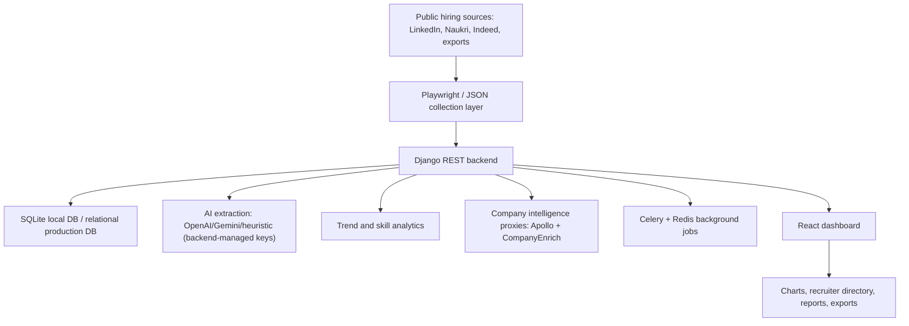

# Architecture

## Backend Modules

- `authentication`: registration, JWT-compatible users, role profile.
- `tasks.models`: tasks, openings, scraped jobs, recruiters, company analytics, hiring trends.
- `tasks.views`: dashboard data, requirement extraction, Apollo/CompanyEnrich proxy, source refresh, dynamic search.
- `tasks.automation`: Playwright scraping scripts.

## Data Flow

1. Scrapers collect public listings.
2. Normalizers convert listings into a common dashboard shape.
3. Dynamic search stores listings in `ScrapedJob`.
4. Dashboard API combines stored data, platform exports, and analytics.
5. Frontend renders charts and exports reports.

## Security Layers

1. Authentication is MFA-based (OTP challenge + verify flow).
2. OTPs are single-use, expire automatically, and old active OTPs are invalidated when new ones are issued.
3. Auth endpoints are scope-throttled to reduce brute-force and abuse.
4. JWT refresh tokens are rotated and blacklisted after rotation.
5. Frontend does not include provider API keys in build config.

