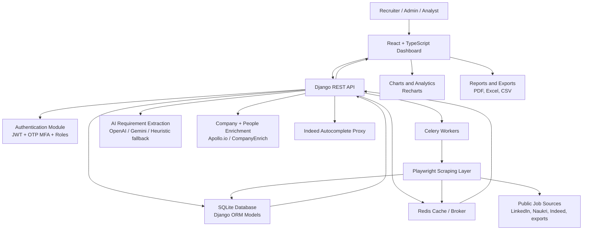
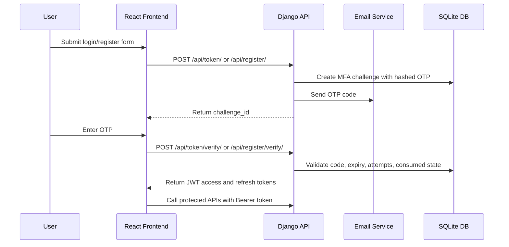
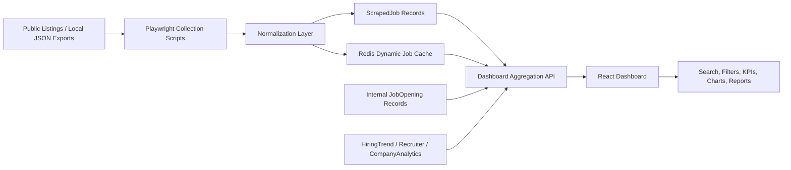
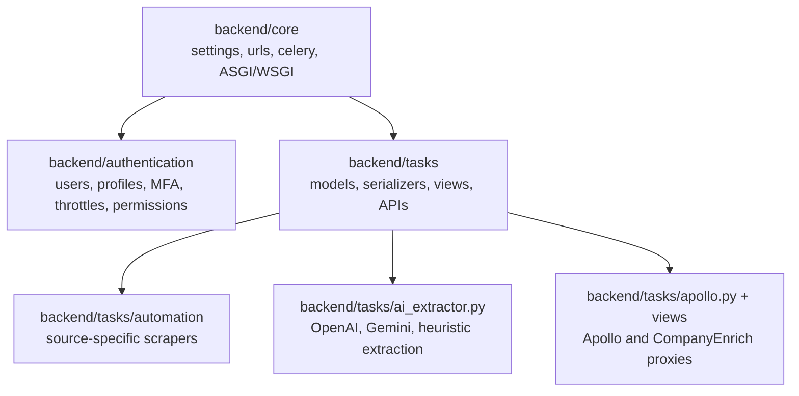
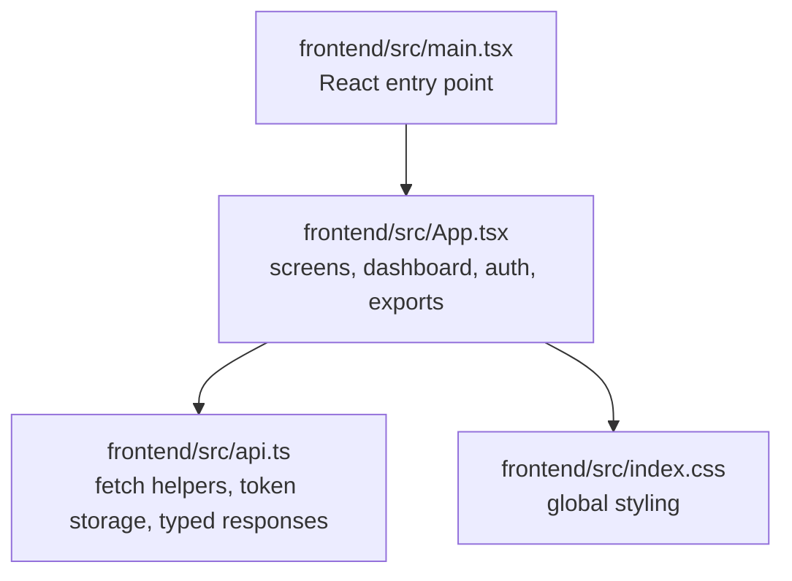

# HireAI Architecture Diagram

This file contains the main architecture diagrams for the HireAI Hiring Intelligence Dashboard. The diagrams use Mermaid syntax, so they render directly in GitHub, many Markdown viewers, and documentation tools that support Mermaid.

## High-Level System Architecture

## Authentication and MFA Flow

## Hiring Data Pipeline

## Backend Module Map

## Frontend Module Map

